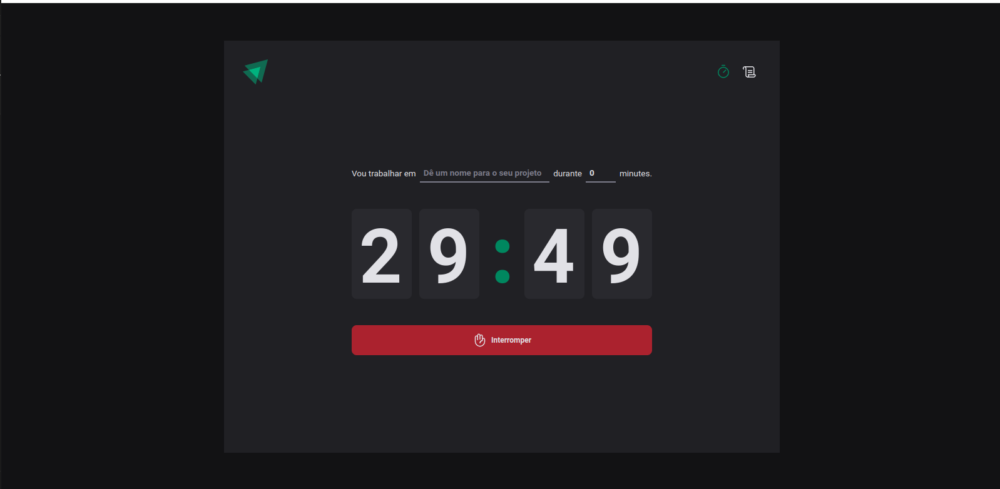

# Ignite Time
 

<p>O ignite time é uma aplicação para ajuda na aplicação da tecnica de pomodoro durante seções de estudo. Você pode acionar fluxos de estudo de no mínimo 5 minutos e no máximo 60 minutos,mantendo o histórico de cliclos rodados.</p>
<p>Desenvolvido durante o módulo Desenvolvimento web front-end com o intuito de apresentar e aprofundar os conceitos de hooks (useState, useEffect e useReducer) no react,uso da cantext API funcionamento dos algoritmos internos do React e o seu fluxo de renderização.</p>

## Rodando a aplicação

```bash
# Clonar a aplicação
git clone git@github.com:MarianaBorges/ignite-time.git

# Abre a pasta do projeto 
cd ignite-time

# Baixa as dependencias do projeto
npm install

# Roda a aplicação 
npm run dev

```

## Rodando a aplicação
* React
* Context API
* Styled-components
